# BudgetPAD — Diagramme de classes (documentation mémoire ENSPD)

- **Projet :** BudgetPAD — suivi budgétaire DRH du Port Autonome de Douala
- **Stack :** Django 4.2 / MySQL-MariaDB / Bootstrap 5
- **Date d'analyse :** 2026-06-07
- **Total classes analysées :** 61 (22 models · 13 forms · 12 contrôleurs de vues · 14 utilitaires)

> Le détail machine (attributs, méthodes, relations, statistiques) est dans **`budgetpad_classes.json`** (même dossier). Ce document contient le diagramme Mermaid, les instructions Figma et la synthèse rédigée.

---

## Phase 3 — Diagramme UML (Mermaid)

```mermaid
classDiagram
    direction LR

    %% ===================== MODELS (bleu) =====================
    class Utilisateur {
        +str role
        +str nom_complet
        +bool must_change_password
        +get_role_display_short() str
    }
    class ExerciceBudgetaire {
        +int annee
        +Decimal montant_global
        +str statut
        +bool is_active
        +bool is_locked
        +int seuil_alerte
        +get_actif()$ ExerciceBudgetaire
        +activer(user)
        +cloturer(user)
    }
    class Tache {
        +FK exercice
        +str numero
        +str titre
        +bool actif
        +budget_ajuste() Decimal
        +consommation() Decimal
        +solde() Decimal
        +taux_consommation() Decimal
    }
    class LigneBudgetaire {
        +FK tache
        +str code_nature
        +str libelle_nature
        +Decimal montant_initial
        +bool actif
    }
    class VirementBudgetaire {
        +FK exercice
        +FK ligne_source
        +FK ligne_destination
        +Decimal montant
        +str motif
        +FK created_by
        +clean()
    }
    class Prestataire {
        +str code
        +str nom
        +str telephone
        +str email
    }
    class DemandeAchat {
        +str reference
        +FK exercice
        +FK ligne_budgetaire
        +str objet
        +Decimal montant_estime
        +str nature_prestation
        +str statut
        +str motif_refus
        +FK created_by
        +peut_transiter_vers(s) tuple
        +save()
    }
    class Offre {
        +FK demande
        +FK prestataire
        +Decimal montant
        +str statut
        +peut_transiter_vers(s) tuple
    }
    class BonCommande {
        +str numero
        +FK demande
        +FK tache
        +FK prestataire
        +str numero_capri
        +date date_capri
        +str condition_paiement
        +str rib_paiement
        +int delai_execution_semaines
        +Decimal montant_ttc
        +str statut
        +calculer_montants()
        +peut_transiter_vers(s) tuple
        +capri_manquant() bool
        +save()
    }
    class LigneBC {
        +FK bon_commande
        +str reference_article
        +str designation
        +str unite
        +Decimal quantite
        +Decimal prix_unitaire_ht
        +montant_ht() Decimal
    }
    class ImputationBC {
        +FK bon_commande
        +FK ligne_budgetaire
        +Decimal montant
    }
    class ConsommationDirecte {
        +FK ligne_budgetaire
        +Decimal montant
        +str motif
        +str numero_capri
        +date date_capri
        +bool est_annule
        +FK created_by
        +capri_manquant() bool
    }
    class ProlongationBC {
        +FK bon_commande
        +date ancienne_echeance
        +date nouvelle_echeance
        +str motif
        +save()
    }
    class HistoriqueStatut {
        +str type_entite
        +int entite_id
        +str ancien_statut
        +str nouveau_statut
        +FK utilisateur
    }
    class JournalActivite {
        +str type_action
        +str description
        +str prev_hash
        +str hash_chain
        +compute_hash() str
        +save()
    }
    class Notification {
        +FK utilisateur
        +str type
        +str titre
        +bool lu
    }
    class Alerte {
        +FK tache
        +str type_alerte
        +str message
        +Decimal seuil_atteint
    }
    class Sequence {
        +str key
        +int value
    }
    class PieceJointe {
        +str type_entite
        +int entite_id
        +str type_piece
        +str titre_personnalise
        +File fichier
        +FK uploaded_by
        +titre_affiche() str
    }
    class RepertoireTache {
        +str numero
        +str titre
        +bool actif
    }
    class RepertoireLigne {
        +FK tache_repertoire
        +str code_nature
        +str libelle_nature
    }
    class LogAnnulation {
        +str type_entite
        +int entite_id
        +str motif_annulation
        +FK annule_par
    }

    %% ===================== FORMS (vert) =====================
    class DemandeAchatForm {
        <<form>>
        +clean() dict
    }
    class BonCommandeEditForm {
        <<form>>
    }
    class ConsommationDirecteForm {
        <<form>>
    }
    class VirementForm {
        <<form>>
        +clean() dict
    }
    class ProlongationBCForm {
        <<form>>
    }
    class AutresForms {
        <<form>>
        Tache/Ligne/Prestataire/Offre*
    }

    %% ===================== VIEWS (orange) =====================
    class DemandeAchatViews {
        <<view>>
        +da_list/create/edit/detail
        +da_en_etude/valider/annuler
    }
    class BonCommandeViews {
        <<view>>
        +bc_list/create/edit/detail
        +bc_change_statut/pdf/prolonger
    }
    class WizardExerciceViews {
        <<view>>
        +step1..4 / activer / api_ligne_solde
    }

    %% ===================== UTILS (gris) =====================
    class BonCommandeService {
        <<service>>
        +creer(...) BonCommande
        +changer_statut(...) dict
    }
    class DemandeAchatService {
        <<service>>
        +creer(...) DemandeAchat
    }
    class VirementService {
        <<service>>
        +creer_virement(...) VirementBudgetaire
    }
    class SequenceService {
        <<service>>
        +next_da_reference() str
        +next_bc_numero() str
    }
    class TacheQuerySet {
        <<manager>>
        +with_aggregates() QuerySet
    }
    class LigneBudgetaireQuerySet {
        <<manager>>
        +with_aggregates() QuerySet
    }

    %% ===================== RELATIONS =====================
    AbstractUser <|-- Utilisateur
    QuerySet <|-- TacheQuerySet
    QuerySet <|-- LigneBudgetaireQuerySet

    ExerciceBudgetaire "1" o-- "*" Tache : taches
    ExerciceBudgetaire "1" o-- "*" DemandeAchat : demandes
    ExerciceBudgetaire "1" o-- "*" BonCommande : BC
    ExerciceBudgetaire "1" o-- "*" VirementBudgetaire : virements
    Tache "1" *-- "*" LigneBudgetaire : lignes
    Tache "1" *-- "*" Alerte : alertes
    LigneBudgetaire "1" --> "*" VirementBudgetaire : source/dest
    LigneBudgetaire "1" --> "*" DemandeAchat : ligne
    LigneBudgetaire "1" --> "*" ImputationBC : imputations
    LigneBudgetaire "1" --> "*" ConsommationDirecte : conso
    Prestataire "1" --> "*" Offre : offres
    Prestataire "1" --> "*" BonCommande : prestataire
    DemandeAchat "1" *-- "*" Offre : offres
    DemandeAchat "1" --> "*" BonCommande : demande
    BonCommande "1" *-- "*" LigneBC : articles
    BonCommande "1" *-- "*" ImputationBC : imputations
    BonCommande "1" *-- "*" ProlongationBC : prolongations
    Utilisateur "1" o-- "*" Notification : notifications
    Utilisateur "1" --> "*" DemandeAchat : created_by
    Utilisateur "1" --> "*" PieceJointe : uploaded_by
    RepertoireTache "1" *-- "*" RepertoireLigne : lignes
    DemandeAchat ..> PieceJointe : polymorphe
    BonCommande ..> PieceJointe : polymorphe
    ConsommationDirecte ..> PieceJointe : polymorphe

    DemandeAchatForm ..> DemandeAchat : ModelForm
    BonCommandeEditForm ..> BonCommande : ModelForm
    ConsommationDirecteForm ..> ConsommationDirecte : ModelForm
    DemandeAchatViews ..> DemandeAchatService : utilise
    BonCommandeViews ..> BonCommandeService : utilise
    BonCommandeService ..> BonCommande : crée
    DemandeAchatService ..> DemandeAchat : crée
    VirementService ..> VirementBudgetaire : crée
    SequenceService ..> Sequence : incrémente
```



> Astuce : colle ce bloc dans [mermaid.live](https://mermaid.live), Typora, ou un viewer Markdown compatible Mermaid pour l'export PNG/SVG haute résolution destiné au mémoire.

---

## Phase 4 — Instructions Figma

```
---FIGMA INSTRUCTIONS---
TITLE: "Diagramme de Classe - BudgetPAD"

COLORS (Thème Afrofuturiste ENSPD):
- Models (Django) : #1E40AF (Bleu profond)   | texte #FFFFFF
- Forms           : #059669 (Vert émeraude)   | texte #FFFFFF
- Views           : #EA580C (Orange/Or)        | texte #FFFFFF
- Utils           : #6B7280 (Gris)             | texte #FFFFFF

FONTS:
- Titre               : Times New Roman, 16pt, Gras
- Nom de classe       : Times New Roman, 12pt, Gras
- Attributs/Méthodes  : Times New Roman, 10pt

LAYOUT (canvas 2400 x 1700, origine haut-gauche) — groupement par type :
  COLONNE A (x=40)   MODELS budget   : ExerciceBudgetaire(y=60), Tache(y=300),
                     LigneBudgetaire(y=520), VirementBudgetaire(y=740)
  COLONNE B (x=320)  MODELS achats   : DemandeAchat(y=60), Offre(y=360),
                     BonCommande(y=540), ImputationBC(y=880)
  COLONNE C (x=600)  MODELS achats 2 : LigneBC(y=60), ConsommationDirecte(y=240),
                     ProlongationBC(y=450), Prestataire(y=600)
  COLONNE D (x=880)  MODELS support  : Utilisateur(y=60), Notification(y=230),
                     Alerte(y=380), Sequence(y=520), RepertoireTache(y=620),
                     RepertoireLigne(y=750)
  COLONNE E (x=1160) MODELS audit    : JournalActivite(y=60), HistoriqueStatut(y=270),
                     PieceJointe(y=430), LogAnnulation(y=640)
  COLONNE F (x=1460) FORMS (vert)    : pile verticale, espacement 90px
  COLONNE G (x=1760) VIEWS (orange)  : DemandeAchatViews, BonCommandeViews, WizardExerciceViews…
  COLONNE H (x=2060) UTILS (gris)    : Services + QuerySets + Filters

BOX DIMENSIONS:
- Largeur : 210px (min 150px) ; +20px si > 6 attributs
- Hauteur : 28px (en-tête) + 16px par ligne (attribut/méthode), min 120px
- Espacement : 100px entre colonnes, 40px entre boîtes d'une colonne
- En-tête coloré (selon type) + corps blanc, bord 1px de la couleur du type
- Compartiments UML : Nom | ──── | Attributs | ──── | Méthodes

CONNECTIONS:
- Héritage (Utilisateur ▷ AbstractUser)     : trait plein, flèche triangle creux
- Composition (CASCADE, ex. LigneBC ◆ BonCommande) : trait plein, losange plein côté parent
- ForeignKey / association (ex. BonCommande → Prestataire) : trait plein, flèche ouverte
- Polymorphe (PieceJointe)                   : trait pointillé, flèche ouverte
- Dépendance (Form/Service → Model)          : trait pointillé, flèche ouverte
- Router les liens en orthogonal ; éviter les croisements en suivant l'ordre des colonnes.
---
```

> Une version **prête à l'emploi** existe déjà :
> - **FigJam (ER)** : https://www.figma.com/board/gCzcn6qEzSuHBEqJRC8KUm
> - **draw.io** : `docs/budgetpad_class_diagram.drawio` (importable dans Figma via plugin « drawio »).

---

## Phase 5 — Synthèse pour le mémoire (≈ 250 mots)

L'architecture de **BudgetPAD** suit le patron **MVT (Model–View–Template)** de Django, complété par une **couche de services métier** qui isole les règles de gestion des vues. L'analyse statique du code recense **61 classes** réparties en quatre catégories : **22 modèles** persistants, **13 formulaires**, une couche de **vues fonctionnelles** (≈ 56 fonctions regroupées en 12 contrôleurs logiques) et **14 utilitaires** (services, *QuerySets* annotés et *FilterSets*).

Le **cœur du domaine** s'organise autour de l'`ExerciceBudgetaire`, qui agrège des `Tache` ; chaque tâche porte des `LigneBudgetaire` sur lesquelles s'imputent les dépenses. Le **circuit d'engagement** est modélisé par la chaîne `DemandeAchat → Offre → BonCommande → LigneBC/ImputationBC`, complétée par la `ConsommationDirecte` (dépense sans bon de commande) et le `VirementBudgetaire` (réallocation de crédit entre lignes). La traçabilité est assurée par un `JournalActivite` **inviolable** (chaîne de hachage SHA-256), l'`HistoriqueStatut` et le `LogAnnulation`.

Plusieurs **patrons de conception** sont identifiables : *Service Layer* (`BonCommandeService`, `DemandeAchatService`, `VirementService`) qui encapsule les transactions atomiques et les contrôles de solde ; *State Machine* (méthodes `peut_transiter_vers` sur DA, Offre et BC) ; *Repository/QuerySet enrichi* (`with_aggregates` via sous-requêtes corrélées pour calculer budget ajusté, consommation et solde) ; et une relation **polymorphe** pour la `PieceJointe`, attachable à n'importe quelle entité. Des règles métier explicites encadrent le système (R7 : exercice actif unique ; R11 : avis CAPRI obligatoire avant toute imputation). L'ensemble traduit une séparation des responsabilités claire et une forte intégrité transactionnelle, adaptées à un contexte de gestion publique.

---

## Statistiques finales

| Métrique | Valeur |
|---|---|
| Total de classes | **61** |
| Modèles (bleu) | 22 |
| Formulaires (vert) | 13 |
| Vues — contrôleurs logiques (orange) | 12 (≈ 56 fonctions) |
| Utilitaires — services/QuerySets/filtres (gris) | 14 |
| Attributs de modèles (champs déclarés) | ≈ 159 |
| Méthodes (modèles + forms + services) | ≈ 92 |
| Relations (FK / composition / héritage / polymorphe) | 47 |

*Les comptes d'attributs/méthodes sont fondés sur les champs déclarés dans `core/models.py` ; les propriétés calculées et méthodes utilitaires sont incluses dans le décompte des méthodes.*
