# Diagramme de Classe — BudgetPAD
*Documentation technique pour mémoire ENSPD — analyse d'architecture logicielle*

Application : **BudgetPAD** — Plateforme de gestion et de suivi budgétaire de la
Direction des Ressources Humaines du **Port Autonome de Douala (PAD)**.
Stack : **Django** (Python), architecture MVT + couche de services métier.
Date d'analyse : **2026-06-07**.

---

## 1. Bloc JSON structuré

```json
{
  "project": "BudgetPAD",
  "description": "Application Django de gestion budgétaire de la DRH du Port Autonome de Douala : suivi des exercices, tâches et lignes budgétaires, demandes d'achat, offres prestataires, bons de commande, virements, consommations directes, avec journal d'audit chaîné par hash SHA-256.",
  "analysis_date": "2026-06-07",
  "total_classes": 51,
  "classes": [
    {
      "id": "CLASS_001",
      "name": "Utilisateur",
      "type": "model",
      "description": "Utilisateur personnalisé étendant AbstractUser, porteur d'un rôle métier.",
      "parent_class": "AbstractUser",
      "app_location": "core.models",
      "attributes": [
        {"name": "role", "type": "CharField", "required": true, "description": "admin / directeur_drh / chef_service / assistante_drh / lecteur"},
        {"name": "nom_complet", "type": "CharField", "required": false},
        {"name": "must_change_password", "type": "BooleanField", "required": false, "description": "Force le changement au 1er login"}
      ],
      "methods": [
        {"name": "__str__", "params": [], "return_type": "str", "is_magic": true},
        {"name": "get_role_display_short", "params": [], "return_type": "str", "is_magic": false}
      ]
    },
    {
      "id": "CLASS_002",
      "name": "ExerciceBudgetaire",
      "type": "model",
      "description": "Exercice budgétaire annuel. Règle R7 : un seul exercice actif à la fois.",
      "parent_class": "models.Model",
      "app_location": "core.models",
      "attributes": [
        {"name": "annee", "type": "IntegerField", "required": true, "description": "Unique"},
        {"name": "date_debut", "type": "DateField", "required": true},
        {"name": "date_fin", "type": "DateField", "required": true},
        {"name": "montant_global", "type": "DecimalField", "required": false},
        {"name": "statut", "type": "CharField", "required": false, "description": "actif / cloture"},
        {"name": "is_active", "type": "BooleanField", "required": false, "description": "Règle R7"},
        {"name": "is_locked", "type": "BooleanField", "required": false, "description": "Lecture seule"},
        {"name": "seuil_alerte", "type": "PositiveSmallIntegerField", "required": false},
        {"name": "exercice_precedent", "type": "ForeignKey(self)", "required": false},
        {"name": "created_at", "type": "DateTimeField", "required": false}
      ],
      "methods": [
        {"name": "__str__", "params": [], "return_type": "str", "is_magic": true},
        {"name": "get_actif", "params": [], "return_type": "ExerciceBudgetaire", "is_magic": false},
        {"name": "activer", "params": ["user"], "return_type": "None", "is_magic": false},
        {"name": "cloturer", "params": ["user"], "return_type": "None", "is_magic": false},
        {"name": "save", "params": ["*args", "**kwargs"], "return_type": "None", "is_magic": false}
      ]
    },
    {
      "id": "CLASS_003",
      "name": "Tache",
      "type": "model",
      "description": "Tâche budgétaire d'un exercice ; regroupe des lignes budgétaires.",
      "parent_class": "models.Model",
      "app_location": "core.models",
      "attributes": [
        {"name": "exercice", "type": "ForeignKey", "required": true, "description": "-> ExerciceBudgetaire"},
        {"name": "numero", "type": "CharField", "required": true},
        {"name": "titre", "type": "CharField", "required": true},
        {"name": "actif", "type": "BooleanField", "required": false},
        {"name": "created_at", "type": "DateTimeField", "required": false},
        {"name": "objects", "type": "TacheManager", "required": false}
      ],
      "methods": [
        {"name": "__str__", "params": [], "return_type": "str", "is_magic": true},
        {"name": "budget_initial", "params": [], "return_type": "Decimal", "is_magic": false},
        {"name": "budget_ajuste", "params": [], "return_type": "Decimal", "is_magic": false},
        {"name": "consommation", "params": [], "return_type": "Decimal", "is_magic": false},
        {"name": "solde", "params": [], "return_type": "Decimal", "is_magic": false},
        {"name": "taux_consommation", "params": [], "return_type": "Decimal", "is_magic": false},
        {"name": "taux_couleur", "params": [], "return_type": "str", "is_magic": false}
      ]
    },
    {
      "id": "CLASS_004",
      "name": "LigneBudgetaire",
      "type": "model",
      "description": "Ligne (nature de dépense) rattachée à une tâche ; unité d'imputation budgétaire.",
      "parent_class": "models.Model",
      "app_location": "core.models",
      "attributes": [
        {"name": "tache", "type": "ForeignKey", "required": true, "description": "-> Tache"},
        {"name": "code_nature", "type": "CharField", "required": true},
        {"name": "libelle_nature", "type": "CharField", "required": true},
        {"name": "montant_initial", "type": "DecimalField", "required": false, "description": "MinValue 0"},
        {"name": "actif", "type": "BooleanField", "required": false},
        {"name": "created_at", "type": "DateTimeField", "required": false},
        {"name": "objects", "type": "LigneBudgetaireManager", "required": false}
      ],
      "methods": [
        {"name": "__str__", "params": [], "return_type": "str", "is_magic": true}
      ]
    },
    {
      "id": "CLASS_005",
      "name": "VirementBudgetaire",
      "type": "model",
      "description": "Virement de crédit d'une ligne source vers une ligne destination.",
      "parent_class": "models.Model",
      "app_location": "core.models",
      "attributes": [
        {"name": "exercice", "type": "ForeignKey", "required": true, "description": "-> ExerciceBudgetaire"},
        {"name": "ligne_source", "type": "ForeignKey", "required": true, "description": "-> LigneBudgetaire (PROTECT)"},
        {"name": "ligne_destination", "type": "ForeignKey", "required": true, "description": "-> LigneBudgetaire (PROTECT)"},
        {"name": "montant", "type": "DecimalField", "required": true, "description": "MinValue 0.01"},
        {"name": "motif", "type": "TextField", "required": true},
        {"name": "created_by", "type": "ForeignKey", "required": false, "description": "-> Utilisateur"},
        {"name": "created_at", "type": "DateTimeField", "required": false}
      ],
      "methods": [
        {"name": "clean", "params": [], "return_type": "None", "is_magic": false},
        {"name": "__str__", "params": [], "return_type": "str", "is_magic": true}
      ]
    },
    {
      "id": "CLASS_006",
      "name": "Prestataire",
      "type": "model",
      "description": "Fournisseur / prestataire pouvant recevoir des bons de commande.",
      "parent_class": "models.Model",
      "app_location": "core.models",
      "attributes": [
        {"name": "code", "type": "CharField", "required": true, "description": "Unique (PREST-NNN)"},
        {"name": "nom", "type": "CharField", "required": true},
        {"name": "adresse", "type": "TextField", "required": false},
        {"name": "telephone", "type": "CharField", "required": false},
        {"name": "email", "type": "EmailField", "required": false},
        {"name": "created_at", "type": "DateTimeField", "required": false}
      ],
      "methods": [
        {"name": "__str__", "params": [], "return_type": "str", "is_magic": true}
      ]
    },
    {
      "id": "CLASS_007",
      "name": "DemandeAchat",
      "type": "model",
      "description": "Demande d'achat (DA) liée à une ligne budgétaire ; machine à états avec transitions contrôlées.",
      "parent_class": "models.Model",
      "app_location": "core.models",
      "attributes": [
        {"name": "reference", "type": "CharField", "required": false, "description": "Unique, auto DAC{AAMM}DLA{NNNNN}"},
        {"name": "exercice", "type": "ForeignKey", "required": true, "description": "-> ExerciceBudgetaire"},
        {"name": "ligne_budgetaire", "type": "ForeignKey", "required": false, "description": "-> LigneBudgetaire (PROTECT)"},
        {"name": "objet", "type": "CharField", "required": true},
        {"name": "montant_estime", "type": "DecimalField", "required": true},
        {"name": "nature_prestation", "type": "CharField", "required": false, "description": "APPRO/Trx/Prestat.Int/Autre"},
        {"name": "periode_engagement", "type": "CharField", "required": false, "description": "P1/P2"},
        {"name": "priorite", "type": "CharField", "required": false},
        {"name": "statut", "type": "CharField", "required": false, "description": "cree/en_etude/validee/bc_cree/annulee"},
        {"name": "motif_refus", "type": "TextField", "required": false},
        {"name": "created_by", "type": "ForeignKey", "required": false, "description": "-> Utilisateur"},
        {"name": "created_at", "type": "DateTimeField", "required": false}
      ],
      "methods": [
        {"name": "__str__", "params": [], "return_type": "str", "is_magic": true},
        {"name": "save", "params": ["*args", "**kwargs"], "return_type": "None", "is_magic": false},
        {"name": "tache", "params": [], "return_type": "Tache", "is_magic": false},
        {"name": "statut_couleur", "params": [], "return_type": "str", "is_magic": false},
        {"name": "peut_transiter_vers", "params": ["nouveau_statut"], "return_type": "tuple[bool,str]", "is_magic": false}
      ]
    },
    {
      "id": "CLASS_008",
      "name": "Offre",
      "type": "model",
      "description": "Offre d'un prestataire pour une DA. Une seule offre retenue par DA.",
      "parent_class": "models.Model",
      "app_location": "core.models",
      "attributes": [
        {"name": "demande", "type": "ForeignKey", "required": true, "description": "-> DemandeAchat"},
        {"name": "prestataire", "type": "ForeignKey", "required": true, "description": "-> Prestataire"},
        {"name": "montant", "type": "DecimalField", "required": false},
        {"name": "statut", "type": "CharField", "required": false, "description": "en_attente/recue/retenue/refusee"},
        {"name": "motif_refus", "type": "TextField", "required": false},
        {"name": "date_sollicitation", "type": "DateTimeField", "required": false},
        {"name": "date_reception", "type": "DateTimeField", "required": false}
      ],
      "methods": [
        {"name": "__str__", "params": [], "return_type": "str", "is_magic": true},
        {"name": "est_en_retard", "params": [], "return_type": "bool", "is_magic": false},
        {"name": "statut_couleur", "params": [], "return_type": "str", "is_magic": false},
        {"name": "statut_icon", "params": [], "return_type": "str", "is_magic": false},
        {"name": "peut_transiter_vers", "params": ["nouveau_statut"], "return_type": "tuple[bool,str]", "is_magic": false}
      ]
    },
    {
      "id": "CLASS_009",
      "name": "BonCommande",
      "type": "model",
      "description": "Bon de commande (BC) émis vers un prestataire ; calcul TVA, échéances, statuts, avis CAPRI (R11).",
      "parent_class": "models.Model",
      "app_location": "core.models",
      "attributes": [
        {"name": "numero", "type": "CharField", "required": false, "description": "Unique, auto STD{AAMM}DLA{NNNNN}"},
        {"name": "demande", "type": "ForeignKey", "required": false, "description": "-> DemandeAchat (PROTECT)"},
        {"name": "tache", "type": "ForeignKey", "required": true, "description": "-> Tache"},
        {"name": "exercice", "type": "ForeignKey", "required": true, "description": "-> ExerciceBudgetaire"},
        {"name": "prestataire", "type": "ForeignKey", "required": true, "description": "-> Prestataire (PROTECT)"},
        {"name": "direction", "type": "CharField", "required": false},
        {"name": "numero_capri", "type": "CharField", "required": false, "description": "Avis CAPRI (R11)"},
        {"name": "date_capri", "type": "DateField", "required": false},
        {"name": "date_emission", "type": "DateField", "required": false},
        {"name": "date_notification", "type": "DateField", "required": false},
        {"name": "delai_execution_jours", "type": "PositiveIntegerField", "required": false, "description": "legacy"},
        {"name": "delai_execution_semaines", "type": "PositiveIntegerField", "required": false},
        {"name": "date_echeance", "type": "DateField", "required": false},
        {"name": "condition_paiement", "type": "CharField", "required": false},
        {"name": "rib_paiement", "type": "CharField", "required": false},
        {"name": "objet", "type": "TextField", "required": false},
        {"name": "taux_tva", "type": "DecimalField", "required": false, "description": "défaut 19.25"},
        {"name": "montant_ht", "type": "DecimalField", "required": false},
        {"name": "montant_tva", "type": "DecimalField", "required": false},
        {"name": "montant_ttc", "type": "DecimalField", "required": false},
        {"name": "statut", "type": "CharField", "required": false, "description": "cree/notifie/en_cours/execute/annule"},
        {"name": "motif_annulation", "type": "TextField", "required": false},
        {"name": "created_at", "type": "DateTimeField", "required": false}
      ],
      "methods": [
        {"name": "__str__", "params": [], "return_type": "str", "is_magic": true},
        {"name": "save", "params": ["*args", "**kwargs"], "return_type": "None", "is_magic": false},
        {"name": "statut_couleur", "params": [], "return_type": "str", "is_magic": false},
        {"name": "est_en_retard", "params": [], "return_type": "bool", "is_magic": false},
        {"name": "jours_restants", "params": [], "return_type": "int", "is_magic": false},
        {"name": "echeance_proche", "params": [], "return_type": "bool", "is_magic": false},
        {"name": "delai_affichage", "params": [], "return_type": "str", "is_magic": false},
        {"name": "capri_manquant", "params": [], "return_type": "bool", "is_magic": false},
        {"name": "recalculer_montants", "params": [], "return_type": "None", "is_magic": false},
        {"name": "peut_transiter", "params": ["nouveau_statut"], "return_type": "bool", "is_magic": false},
        {"name": "peut_transiter_vers", "params": ["nouveau_statut"], "return_type": "tuple[bool,str]", "is_magic": false},
        {"name": "calculer_montants", "params": [], "return_type": "None", "is_magic": false}
      ]
    },
    {
      "id": "CLASS_010",
      "name": "ImputationBC",
      "type": "model",
      "description": "Imputation d'un montant d'un BC sur une ligne budgétaire.",
      "parent_class": "models.Model",
      "app_location": "core.models",
      "attributes": [
        {"name": "bon_commande", "type": "ForeignKey", "required": true, "description": "-> BonCommande"},
        {"name": "ligne_budgetaire", "type": "ForeignKey", "required": true, "description": "-> LigneBudgetaire (PROTECT)"},
        {"name": "montant", "type": "DecimalField", "required": true},
        {"name": "description", "type": "CharField", "required": false}
      ],
      "methods": [
        {"name": "__str__", "params": [], "return_type": "str", "is_magic": true}
      ]
    },
    {
      "id": "CLASS_011",
      "name": "ConsommationDirecte",
      "type": "model",
      "description": "Consommation budgétaire sans BC (achat direct, urgence...) avec soft-delete et avis CAPRI.",
      "parent_class": "models.Model",
      "app_location": "core.models",
      "attributes": [
        {"name": "ligne_budgetaire", "type": "ForeignKey", "required": true, "description": "-> LigneBudgetaire (PROTECT)"},
        {"name": "montant", "type": "DecimalField", "required": true, "description": "MinValue 0.01"},
        {"name": "motif", "type": "CharField", "required": true},
        {"name": "description", "type": "TextField", "required": false},
        {"name": "date_consommation", "type": "DateField", "required": true},
        {"name": "numero_capri", "type": "CharField", "required": false},
        {"name": "date_capri", "type": "DateField", "required": false},
        {"name": "created_by", "type": "ForeignKey", "required": false, "description": "-> Utilisateur"},
        {"name": "created_at", "type": "DateTimeField", "required": false},
        {"name": "est_annule", "type": "BooleanField", "required": false},
        {"name": "annule_le", "type": "DateTimeField", "required": false},
        {"name": "annule_par", "type": "ForeignKey", "required": false, "description": "-> Utilisateur"},
        {"name": "motif_annulation", "type": "TextField", "required": false}
      ],
      "methods": [
        {"name": "capri_manquant", "params": [], "return_type": "bool", "is_magic": false},
        {"name": "__str__", "params": [], "return_type": "str", "is_magic": true}
      ]
    },
    {
      "id": "CLASS_012",
      "name": "ProlongationBC",
      "type": "model",
      "description": "Prolongation d'échéance d'un BC ; met à jour date_echeance du BC.",
      "parent_class": "models.Model",
      "app_location": "core.models",
      "attributes": [
        {"name": "bon_commande", "type": "ForeignKey", "required": true, "description": "-> BonCommande"},
        {"name": "ancienne_echeance", "type": "DateField", "required": true},
        {"name": "nouvelle_echeance", "type": "DateField", "required": true},
        {"name": "duree_prolongation_jours", "type": "PositiveIntegerField", "required": false},
        {"name": "motif", "type": "TextField", "required": true},
        {"name": "created_by", "type": "ForeignKey", "required": false, "description": "-> Utilisateur"},
        {"name": "created_at", "type": "DateTimeField", "required": false}
      ],
      "methods": [
        {"name": "save", "params": ["*args", "**kwargs"], "return_type": "None", "is_magic": false},
        {"name": "__str__", "params": [], "return_type": "str", "is_magic": true}
      ]
    },
    {
      "id": "CLASS_013",
      "name": "LigneBC",
      "type": "model",
      "description": "Article (ligne) d'un bon de commande : désignation, quantité, prix unitaire.",
      "parent_class": "models.Model",
      "app_location": "core.models",
      "attributes": [
        {"name": "bon_commande", "type": "ForeignKey", "required": true, "description": "-> BonCommande"},
        {"name": "reference_article", "type": "CharField", "required": false},
        {"name": "designation", "type": "CharField", "required": true},
        {"name": "unite", "type": "CharField", "required": false},
        {"name": "quantite", "type": "DecimalField", "required": true, "description": "MinValue 0.01"},
        {"name": "prix_unitaire_ht", "type": "DecimalField", "required": true},
        {"name": "ordre", "type": "IntegerField", "required": false}
      ],
      "methods": [
        {"name": "montant_ht", "params": [], "return_type": "Decimal", "is_magic": false},
        {"name": "__str__", "params": [], "return_type": "str", "is_magic": true}
      ]
    },
    {
      "id": "CLASS_014",
      "name": "HistoriqueStatut",
      "type": "model",
      "description": "Trace polymorphe des changements de statut DA/BC.",
      "parent_class": "models.Model",
      "app_location": "core.models",
      "attributes": [
        {"name": "type_entite", "type": "CharField", "required": true, "description": "DA/BC"},
        {"name": "entite_id", "type": "IntegerField", "required": true},
        {"name": "ancien_statut", "type": "CharField", "required": true},
        {"name": "nouveau_statut", "type": "CharField", "required": true},
        {"name": "utilisateur", "type": "ForeignKey", "required": false, "description": "-> Utilisateur"},
        {"name": "commentaire", "type": "TextField", "required": false},
        {"name": "created_at", "type": "DateTimeField", "required": false}
      ],
      "methods": []
    },
    {
      "id": "CLASS_015",
      "name": "JournalActivite",
      "type": "model",
      "description": "Journal d'audit inviolable : chaînage par hash SHA-256 (prev_hash + hash_chain).",
      "parent_class": "models.Model",
      "app_location": "core.models",
      "attributes": [
        {"name": "type_action", "type": "CharField", "required": true},
        {"name": "description", "type": "TextField", "required": true},
        {"name": "entite_type", "type": "CharField", "required": false},
        {"name": "entite_id", "type": "IntegerField", "required": false},
        {"name": "utilisateur", "type": "ForeignKey", "required": false, "description": "-> Utilisateur"},
        {"name": "created_at", "type": "DateTimeField", "required": false},
        {"name": "prev_hash", "type": "CharField", "required": false, "description": "Hash de l'entrée précédente"},
        {"name": "hash_chain", "type": "CharField", "required": false, "description": "Hash SHA-256 de l'entrée"}
      ],
      "methods": [
        {"name": "__str__", "params": [], "return_type": "str", "is_magic": true},
        {"name": "compute_hash", "params": [], "return_type": "str", "is_magic": false},
        {"name": "save", "params": ["*args", "**kwargs"], "return_type": "None", "is_magic": false}
      ]
    },
    {
      "id": "CLASS_016",
      "name": "Notification",
      "type": "model",
      "description": "Notification destinée à un utilisateur.",
      "parent_class": "models.Model",
      "app_location": "core.models",
      "attributes": [
        {"name": "utilisateur", "type": "ForeignKey", "required": true, "description": "-> Utilisateur"},
        {"name": "type", "type": "CharField", "required": true},
        {"name": "titre", "type": "CharField", "required": true},
        {"name": "message", "type": "TextField", "required": true},
        {"name": "entite_type", "type": "CharField", "required": false},
        {"name": "entite_id", "type": "IntegerField", "required": false},
        {"name": "lu", "type": "BooleanField", "required": false},
        {"name": "created_at", "type": "DateTimeField", "required": false}
      ],
      "methods": [
        {"name": "__str__", "params": [], "return_type": "str", "is_magic": true}
      ]
    },
    {
      "id": "CLASS_017",
      "name": "Alerte",
      "type": "model",
      "description": "Alerte de dépassement de seuil de consommation sur une tâche.",
      "parent_class": "models.Model",
      "app_location": "core.models",
      "attributes": [
        {"name": "tache", "type": "ForeignKey", "required": true, "description": "-> Tache"},
        {"name": "type_alerte", "type": "CharField", "required": true},
        {"name": "message", "type": "TextField", "required": true},
        {"name": "seuil_atteint", "type": "DecimalField", "required": false},
        {"name": "lu", "type": "BooleanField", "required": false},
        {"name": "created_at", "type": "DateTimeField", "required": false}
      ],
      "methods": [
        {"name": "__str__", "params": [], "return_type": "str", "is_magic": true}
      ]
    },
    {
      "id": "CLASS_018",
      "name": "Sequence",
      "type": "model",
      "description": "Compteur atomique nommé pour la numérotation (DA, BC, prestataires...).",
      "parent_class": "models.Model",
      "app_location": "core.models",
      "attributes": [
        {"name": "key", "type": "CharField", "required": true, "description": "Unique"},
        {"name": "value", "type": "IntegerField", "required": false}
      ],
      "methods": [
        {"name": "__str__", "params": [], "return_type": "str", "is_magic": true}
      ]
    },
    {
      "id": "CLASS_019",
      "name": "PieceJointe",
      "type": "model",
      "description": "Pièce jointe polymorphe (DA/BC/offre/conso) avec validation MIME et taille.",
      "parent_class": "models.Model",
      "app_location": "core.models",
      "attributes": [
        {"name": "type_entite", "type": "CharField", "required": true, "description": "da/bc/offre/conso"},
        {"name": "entite_id", "type": "IntegerField", "required": true},
        {"name": "type_piece", "type": "CharField", "required": false},
        {"name": "titre_personnalise", "type": "CharField", "required": false},
        {"name": "fichier", "type": "FileField", "required": true},
        {"name": "nom_original", "type": "CharField", "required": true},
        {"name": "taille", "type": "PositiveIntegerField", "required": false},
        {"name": "uploaded_by", "type": "ForeignKey", "required": false, "description": "-> Utilisateur"},
        {"name": "created_at", "type": "DateTimeField", "required": false}
      ],
      "methods": [
        {"name": "__str__", "params": [], "return_type": "str", "is_magic": true},
        {"name": "titre_affiche", "params": [], "return_type": "str", "is_magic": false},
        {"name": "extension", "params": [], "return_type": "str", "is_magic": false},
        {"name": "icone", "params": [], "return_type": "str", "is_magic": false},
        {"name": "couleur_icone", "params": [], "return_type": "str", "is_magic": false},
        {"name": "taille_lisible", "params": [], "return_type": "str", "is_magic": false}
      ]
    },
    {
      "id": "CLASS_020",
      "name": "RepertoireTache",
      "type": "model",
      "description": "Catalogue global de tâches réutilisable entre exercices.",
      "parent_class": "models.Model",
      "app_location": "core.models",
      "attributes": [
        {"name": "numero", "type": "CharField", "required": true, "description": "Unique"},
        {"name": "titre", "type": "CharField", "required": true},
        {"name": "actif", "type": "BooleanField", "required": false},
        {"name": "created_at", "type": "DateTimeField", "required": false}
      ],
      "methods": [
        {"name": "__str__", "params": [], "return_type": "str", "is_magic": true}
      ]
    },
    {
      "id": "CLASS_021",
      "name": "RepertoireLigne",
      "type": "model",
      "description": "Catalogue global de lignes budgétaires rattachées à une tâche du répertoire.",
      "parent_class": "models.Model",
      "app_location": "core.models",
      "attributes": [
        {"name": "tache_repertoire", "type": "ForeignKey", "required": true, "description": "-> RepertoireTache"},
        {"name": "code_nature", "type": "CharField", "required": true},
        {"name": "libelle_nature", "type": "CharField", "required": true},
        {"name": "actif", "type": "BooleanField", "required": false},
        {"name": "created_at", "type": "DateTimeField", "required": false}
      ],
      "methods": [
        {"name": "__str__", "params": [], "return_type": "str", "is_magic": true}
      ]
    },
    {
      "id": "CLASS_022",
      "name": "LogAnnulation",
      "type": "model",
      "description": "Trace des annulations administratives (consommations, virements, DA, BC).",
      "parent_class": "models.Model",
      "app_location": "core.models",
      "attributes": [
        {"name": "type_entite", "type": "CharField", "required": true},
        {"name": "entite_id", "type": "IntegerField", "required": true},
        {"name": "description_avant", "type": "TextField", "required": true},
        {"name": "motif_annulation", "type": "TextField", "required": true},
        {"name": "annule_par", "type": "ForeignKey", "required": false, "description": "-> Utilisateur"},
        {"name": "annule_le", "type": "DateTimeField", "required": false}
      ],
      "methods": [
        {"name": "__str__", "params": [], "return_type": "str", "is_magic": true}
      ]
    },
    {
      "id": "CLASS_023",
      "name": "TacheQuerySet",
      "type": "util",
      "description": "QuerySet custom : agrégats budgétaires par sous-requêtes corrélées (évite le produit cartésien).",
      "parent_class": "models.QuerySet",
      "app_location": "core.models",
      "attributes": [],
      "methods": [
        {"name": "with_aggregates", "params": [], "return_type": "QuerySet", "is_magic": false}
      ]
    },
    {
      "id": "CLASS_024",
      "name": "TacheManager",
      "type": "util",
      "description": "Manager exposant TacheQuerySet sur Tache.objects.",
      "parent_class": "Manager.from_queryset(TacheQuerySet)",
      "app_location": "core.models",
      "attributes": [],
      "methods": []
    },
    {
      "id": "CLASS_025",
      "name": "LigneBudgetaireQuerySet",
      "type": "util",
      "description": "QuerySet custom : agrégats (transferts, consommations, solde, taux) par ligne.",
      "parent_class": "models.QuerySet",
      "app_location": "core.models",
      "attributes": [],
      "methods": [
        {"name": "with_aggregates", "params": [], "return_type": "QuerySet", "is_magic": false}
      ]
    },
    {
      "id": "CLASS_026",
      "name": "LigneBudgetaireManager",
      "type": "util",
      "description": "Manager exposant LigneBudgetaireQuerySet sur LigneBudgetaire.objects.",
      "parent_class": "Manager.from_queryset(LigneBudgetaireQuerySet)",
      "app_location": "core.models",
      "attributes": [],
      "methods": []
    },
    {
      "id": "CLASS_027",
      "name": "BonCommandeService",
      "type": "util",
      "description": "Service métier BC : calcul TVA, création sous lock pessimiste, vérification du solde (R1), transitions de statut.",
      "parent_class": null,
      "app_location": "core.services.bon_commande_service",
      "attributes": [],
      "methods": [
        {"name": "calculer_montants_avec_tva", "params": ["montant_ht", "taux_tva"], "return_type": "dict", "is_magic": false},
        {"name": "creer", "params": ["tache", "prestataire", "montant_ht", "utilisateur", "..."], "return_type": "BonCommande", "is_magic": false},
        {"name": "peut_transiter", "params": ["bc", "nouveau_statut"], "return_type": "bool", "is_magic": false},
        {"name": "changer_statut", "params": ["bc", "nouveau_statut", "utilisateur", "..."], "return_type": "dict", "is_magic": false}
      ]
    },
    {
      "id": "CLASS_028",
      "name": "DemandeAchatService",
      "type": "util",
      "description": "Service métier DA : création atomique, journal, notification des valideurs.",
      "parent_class": null,
      "app_location": "core.services.demande_achat_service",
      "attributes": [],
      "methods": [
        {"name": "creer", "params": ["ligne_budgetaire", "objet", "montant_estime", "utilisateur", "..."], "return_type": "DemandeAchat", "is_magic": false}
      ]
    },
    {
      "id": "CLASS_029",
      "name": "NotificationService",
      "type": "util",
      "description": "Service de création de notifications ciblées (par utilisateur ou par rôle).",
      "parent_class": null,
      "app_location": "core.services.notification_service",
      "attributes": [],
      "methods": [
        {"name": "notifier", "params": ["utilisateur", "type_notif", "titre", "message", "..."], "return_type": "Notification", "is_magic": false},
        {"name": "notifier_roles", "params": ["roles", "type_notif", "titre", "message", "..."], "return_type": "int", "is_magic": false},
        {"name": "marquer_lues", "params": ["utilisateur", "ids"], "return_type": "int", "is_magic": false}
      ]
    },
    {
      "id": "CLASS_030",
      "name": "SequenceService",
      "type": "util",
      "description": "Numérotation atomique self-healing (select_for_update) au format réel PAD.",
      "parent_class": null,
      "app_location": "core.services.sequence_service",
      "attributes": [],
      "methods": [
        {"name": "next_value", "params": ["key"], "return_type": "int", "is_magic": false},
        {"name": "_ensure_sync", "params": ["key", "model", "field", "prefix", "pattern"], "return_type": "None", "is_magic": false},
        {"name": "next_bc_numero", "params": ["annee"], "return_type": "str", "is_magic": false},
        {"name": "next_da_reference", "params": ["annee"], "return_type": "str", "is_magic": false},
        {"name": "next_prestataire_code", "params": [], "return_type": "str", "is_magic": false},
        {"name": "next_tache_numero", "params": ["exercice_annee"], "return_type": "str", "is_magic": false}
      ]
    },
    {
      "id": "CLASS_031",
      "name": "TacheService",
      "type": "util",
      "description": "Service métier Tâche : génération d'alertes de seuil, couleur du taux.",
      "parent_class": null,
      "app_location": "core.services.tache_service",
      "attributes": [],
      "methods": [
        {"name": "verifier_alertes", "params": ["tache", "seuil"], "return_type": "None", "is_magic": false},
        {"name": "get_taux_couleur", "params": ["taux_consommation"], "return_type": "str", "is_magic": false}
      ]
    },
    {
      "id": "CLASS_032",
      "name": "VirementService",
      "type": "util",
      "description": "Service métier virement : validation et création sous lock pessimiste avec contrôle du solde source.",
      "parent_class": null,
      "app_location": "core.services.virement_service",
      "attributes": [],
      "methods": [
        {"name": "creer_virement", "params": ["ligne_source", "ligne_destination", "montant", "motif", "utilisateur", "exercice"], "return_type": "VirementBudgetaire", "is_magic": false}
      ]
    },
    {
      "id": "CLASS_033",
      "name": "VirementForm",
      "type": "form",
      "description": "Formulaire de virement entre lignes ; valide solde et lignes distinctes.",
      "parent_class": "forms.ModelForm",
      "app_location": "core.forms",
      "attributes": [
        {"name": "ligne_source", "type": "ModelChoiceField", "required": true},
        {"name": "ligne_destination", "type": "ModelChoiceField", "required": true},
        {"name": "montant", "type": "DecimalField", "required": true},
        {"name": "motif", "type": "CharField", "required": true}
      ],
      "methods": [
        {"name": "__init__", "params": ["*args", "exercice", "**kwargs"], "return_type": "None", "is_magic": false},
        {"name": "clean", "params": [], "return_type": "dict", "is_magic": false}
      ]
    },
    {
      "id": "CLASS_034",
      "name": "PrestataireForm",
      "type": "form",
      "description": "Formulaire de création/édition de prestataire.",
      "parent_class": "forms.ModelForm",
      "app_location": "core.forms",
      "attributes": [
        {"name": "nom", "type": "CharField", "required": true},
        {"name": "adresse", "type": "CharField", "required": false},
        {"name": "telephone", "type": "CharField", "required": false},
        {"name": "email", "type": "EmailField", "required": false}
      ],
      "methods": []
    },
    {
      "id": "CLASS_035",
      "name": "TacheForm",
      "type": "form",
      "description": "Formulaire de tâche (numéro, titre).",
      "parent_class": "forms.ModelForm",
      "app_location": "core.forms",
      "attributes": [
        {"name": "numero", "type": "CharField", "required": true},
        {"name": "titre", "type": "CharField", "required": true}
      ],
      "methods": []
    },
    {
      "id": "CLASS_036",
      "name": "LigneBudgetaireForm",
      "type": "form",
      "description": "Formulaire de ligne budgétaire (code, libellé, montant initial).",
      "parent_class": "forms.ModelForm",
      "app_location": "core.forms",
      "attributes": [
        {"name": "code_nature", "type": "CharField", "required": true},
        {"name": "libelle_nature", "type": "CharField", "required": true},
        {"name": "montant_initial", "type": "DecimalField", "required": false}
      ],
      "methods": []
    },
    {
      "id": "CLASS_037",
      "name": "DemandeAchatForm",
      "type": "form",
      "description": "Création de DA ; queryset filtré par exercice, contrôle du solde disponible réel.",
      "parent_class": "forms.ModelForm",
      "app_location": "core.forms",
      "attributes": [
        {"name": "reference", "type": "CharField", "required": false},
        {"name": "ligne_budgetaire", "type": "ModelChoiceField", "required": true},
        {"name": "objet", "type": "CharField", "required": true},
        {"name": "montant_estime", "type": "DecimalField", "required": true},
        {"name": "nature_prestation", "type": "ChoiceField", "required": false},
        {"name": "periode_engagement", "type": "ChoiceField", "required": false},
        {"name": "priorite", "type": "ChoiceField", "required": false}
      ],
      "methods": [
        {"name": "__init__", "params": ["*args", "exercice", "**kwargs"], "return_type": "None", "is_magic": false},
        {"name": "clean_montant_estime", "params": [], "return_type": "Decimal", "is_magic": false},
        {"name": "clean", "params": [], "return_type": "dict", "is_magic": false}
      ]
    },
    {
      "id": "CLASS_038",
      "name": "DemandeAchatEditForm",
      "type": "form",
      "description": "Édition d'une DA existante avec recontrôle du solde disponible.",
      "parent_class": "forms.ModelForm",
      "app_location": "core.forms",
      "attributes": [
        {"name": "reference", "type": "CharField", "required": false},
        {"name": "ligne_budgetaire", "type": "ModelChoiceField", "required": true},
        {"name": "objet", "type": "CharField", "required": true},
        {"name": "montant_estime", "type": "DecimalField", "required": true},
        {"name": "nature_prestation", "type": "ChoiceField", "required": false},
        {"name": "periode_engagement", "type": "ChoiceField", "required": false},
        {"name": "priorite", "type": "ChoiceField", "required": false}
      ],
      "methods": [
        {"name": "__init__", "params": ["*args", "exercice", "**kwargs"], "return_type": "None", "is_magic": false},
        {"name": "clean", "params": [], "return_type": "dict", "is_magic": false}
      ]
    },
    {
      "id": "CLASS_039",
      "name": "BonCommandeForm",
      "type": "form",
      "description": "Création simple de BC (numéro auto optionnel).",
      "parent_class": "forms.ModelForm",
      "app_location": "core.forms",
      "attributes": [
        {"name": "numero", "type": "CharField", "required": false},
        {"name": "tache", "type": "ModelChoiceField", "required": true},
        {"name": "prestataire", "type": "ModelChoiceField", "required": true},
        {"name": "montant_ht", "type": "DecimalField", "required": true},
        {"name": "delai_execution_jours", "type": "IntegerField", "required": false}
      ],
      "methods": [
        {"name": "__init__", "params": ["*args", "**kwargs"], "return_type": "None", "is_magic": false}
      ]
    },
    {
      "id": "CLASS_040",
      "name": "BonCommandeEditForm",
      "type": "form",
      "description": "Édition de BC ; CAPRI obligatoire (R11), échéances et conditions de paiement.",
      "parent_class": "forms.ModelForm",
      "app_location": "core.forms",
      "attributes": [
        {"name": "numero", "type": "CharField", "required": true},
        {"name": "objet", "type": "CharField", "required": false},
        {"name": "numero_capri", "type": "CharField", "required": true},
        {"name": "date_capri", "type": "DateField", "required": true},
        {"name": "montant_ht", "type": "DecimalField", "required": true},
        {"name": "taux_tva", "type": "DecimalField", "required": true},
        {"name": "condition_paiement", "type": "ChoiceField", "required": true},
        {"name": "rib_paiement", "type": "CharField", "required": false},
        {"name": "date_notification", "type": "DateField", "required": false},
        {"name": "delai_execution_semaines", "type": "IntegerField", "required": false},
        {"name": "date_echeance", "type": "DateField", "required": false}
      ],
      "methods": [
        {"name": "__init__", "params": ["*args", "**kwargs"], "return_type": "None", "is_magic": false}
      ]
    },
    {
      "id": "CLASS_041",
      "name": "ProlongationBCForm",
      "type": "form",
      "description": "Prolongation d'échéance de BC ; nouvelle échéance future obligatoire.",
      "parent_class": "forms.ModelForm",
      "app_location": "core.forms",
      "attributes": [
        {"name": "nouvelle_echeance", "type": "DateField", "required": true},
        {"name": "motif", "type": "CharField", "required": true}
      ],
      "methods": [
        {"name": "clean_nouvelle_echeance", "params": [], "return_type": "date", "is_magic": false}
      ]
    },
    {
      "id": "CLASS_042",
      "name": "OffreSolliciterForm",
      "type": "form",
      "description": "Sollicitation d'un prestataire pour une DA.",
      "parent_class": "forms.Form",
      "app_location": "core.forms",
      "attributes": [
        {"name": "prestataire", "type": "ModelChoiceField", "required": true}
      ],
      "methods": []
    },
    {
      "id": "CLASS_043",
      "name": "OffreSaisirForm",
      "type": "form",
      "description": "Saisie du montant d'une offre reçue.",
      "parent_class": "forms.Form",
      "app_location": "core.forms",
      "attributes": [
        {"name": "montant", "type": "DecimalField", "required": true}
      ],
      "methods": [
        {"name": "clean_montant", "params": [], "return_type": "Decimal", "is_magic": false}
      ]
    },
    {
      "id": "CLASS_044",
      "name": "OffreRefuserForm",
      "type": "form",
      "description": "Refus motivé d'une offre.",
      "parent_class": "forms.Form",
      "app_location": "core.forms",
      "attributes": [
        {"name": "motif", "type": "CharField", "required": true}
      ],
      "methods": [
        {"name": "clean_motif", "params": [], "return_type": "str", "is_magic": false}
      ]
    },
    {
      "id": "CLASS_045",
      "name": "ConsommationDirecteForm",
      "type": "form",
      "description": "Saisie d'une consommation directe ; CAPRI obligatoire (R11).",
      "parent_class": "forms.ModelForm",
      "app_location": "core.forms",
      "attributes": [
        {"name": "motif", "type": "ChoiceField", "required": true},
        {"name": "montant", "type": "DecimalField", "required": true},
        {"name": "description", "type": "CharField", "required": false},
        {"name": "date_consommation", "type": "DateField", "required": true},
        {"name": "numero_capri", "type": "CharField", "required": true},
        {"name": "date_capri", "type": "DateField", "required": true}
      ],
      "methods": [
        {"name": "__init__", "params": ["*args", "**kwargs"], "return_type": "None", "is_magic": false}
      ]
    },
    {
      "id": "CLASS_046",
      "name": "BonCommandeFilter",
      "type": "form",
      "description": "FilterSet django-filter pour la liste des BC (numéro, statut, tâche, prestataire, dates).",
      "parent_class": "django_filters.FilterSet",
      "app_location": "core.filters",
      "attributes": [
        {"name": "numero", "type": "CharFilter", "required": false},
        {"name": "statut", "type": "ChoiceFilter", "required": false},
        {"name": "tache", "type": "ModelChoiceFilter", "required": false},
        {"name": "prestataire", "type": "ModelChoiceFilter", "required": false},
        {"name": "date_debut", "type": "DateFilter", "required": false},
        {"name": "date_fin", "type": "DateFilter", "required": false}
      ],
      "methods": []
    },
    {
      "id": "CLASS_047",
      "name": "DemandeAchatFilter",
      "type": "form",
      "description": "FilterSet pour la liste des DA (référence, objet, statut, tâche, dates).",
      "parent_class": "django_filters.FilterSet",
      "app_location": "core.filters",
      "attributes": [
        {"name": "reference", "type": "CharFilter", "required": false},
        {"name": "objet", "type": "CharFilter", "required": false},
        {"name": "statut", "type": "ChoiceFilter", "required": false},
        {"name": "tache", "type": "ModelChoiceFilter", "required": false},
        {"name": "date_debut", "type": "DateFilter", "required": false},
        {"name": "date_fin", "type": "DateFilter", "required": false}
      ],
      "methods": []
    },
    {
      "id": "CLASS_048",
      "name": "JournalFilter",
      "type": "form",
      "description": "FilterSet pour le journal d'activité (type d'action, description).",
      "parent_class": "django_filters.FilterSet",
      "app_location": "core.filters",
      "attributes": [
        {"name": "type_action", "type": "ChoiceFilter", "required": false},
        {"name": "description", "type": "CharFilter", "required": false}
      ],
      "methods": []
    },
    {
      "id": "CLASS_049",
      "name": "PrestataireFilter",
      "type": "form",
      "description": "FilterSet pour la liste des prestataires (nom).",
      "parent_class": "django_filters.FilterSet",
      "app_location": "core.filters",
      "attributes": [
        {"name": "nom", "type": "CharFilter", "required": false}
      ],
      "methods": []
    },
    {
      "id": "CLASS_050",
      "name": "RoleRequiredMixin",
      "type": "view",
      "description": "Mixin de contrôle d'accès basé sur le rôle ; 'admin' contourne la restriction.",
      "parent_class": "LoginRequiredMixin",
      "app_location": "core.mixins",
      "attributes": [
        {"name": "allowed_roles", "type": "tuple[str]", "required": false},
        {"name": "permission_denied_redirect", "type": "str", "required": false}
      ],
      "methods": [
        {"name": "dispatch", "params": ["request", "*args", "**kwargs"], "return_type": "HttpResponse", "is_magic": false}
      ]
    },
    {
      "id": "CLASS_051",
      "name": "ForcePasswordChangeMiddleware",
      "type": "view",
      "description": "Middleware forçant le changement de mot de passe au 1er login (must_change_password).",
      "parent_class": null,
      "app_location": "core.middleware",
      "attributes": [
        {"name": "EXEMPT_URL_NAMES", "type": "set[str]", "required": false}
      ],
      "methods": [
        {"name": "__init__", "params": ["get_response"], "return_type": "None", "is_magic": false},
        {"name": "__call__", "params": ["request"], "return_type": "HttpResponse", "is_magic": true},
        {"name": "process_view", "params": ["request", "view_func", "view_args", "view_kwargs"], "return_type": "HttpResponse | None", "is_magic": false}
      ]
    }
  ],
  "relationships": [
    {"from_class": "Utilisateur", "to_class": "AbstractUser", "type": "inheritance", "cardinality": "1:1", "label": "hérite de"},
    {"from_class": "RoleRequiredMixin", "to_class": "LoginRequiredMixin", "type": "inheritance", "cardinality": "1:1", "label": "hérite de"},
    {"from_class": "TacheQuerySet", "to_class": "models.QuerySet", "type": "inheritance", "cardinality": "1:1", "label": "hérite de"},
    {"from_class": "LigneBudgetaireQuerySet", "to_class": "models.QuerySet", "type": "inheritance", "cardinality": "1:1", "label": "hérite de"},
    {"from_class": "ExerciceBudgetaire", "to_class": "ExerciceBudgetaire", "type": "foreign_key", "cardinality": "1:N", "label": "exercice_precedent"},
    {"from_class": "Tache", "to_class": "ExerciceBudgetaire", "type": "foreign_key", "cardinality": "N:1", "label": "exercice"},
    {"from_class": "LigneBudgetaire", "to_class": "Tache", "type": "foreign_key", "cardinality": "N:1", "label": "tache"},
    {"from_class": "VirementBudgetaire", "to_class": "ExerciceBudgetaire", "type": "foreign_key", "cardinality": "N:1", "label": "exercice"},
    {"from_class": "VirementBudgetaire", "to_class": "LigneBudgetaire", "type": "foreign_key", "cardinality": "N:1", "label": "ligne_source"},
    {"from_class": "VirementBudgetaire", "to_class": "LigneBudgetaire", "type": "foreign_key", "cardinality": "N:1", "label": "ligne_destination"},
    {"from_class": "VirementBudgetaire", "to_class": "Utilisateur", "type": "foreign_key", "cardinality": "N:1", "label": "created_by"},
    {"from_class": "DemandeAchat", "to_class": "ExerciceBudgetaire", "type": "foreign_key", "cardinality": "N:1", "label": "exercice"},
    {"from_class": "DemandeAchat", "to_class": "LigneBudgetaire", "type": "foreign_key", "cardinality": "N:1", "label": "ligne_budgetaire"},
    {"from_class": "DemandeAchat", "to_class": "Utilisateur", "type": "foreign_key", "cardinality": "N:1", "label": "created_by"},
    {"from_class": "Offre", "to_class": "DemandeAchat", "type": "foreign_key", "cardinality": "N:1", "label": "demande"},
    {"from_class": "Offre", "to_class": "Prestataire", "type": "foreign_key", "cardinality": "N:1", "label": "prestataire"},
    {"from_class": "BonCommande", "to_class": "DemandeAchat", "type": "foreign_key", "cardinality": "N:1", "label": "demande"},
    {"from_class": "BonCommande", "to_class": "Tache", "type": "foreign_key", "cardinality": "N:1", "label": "tache"},
    {"from_class": "BonCommande", "to_class": "ExerciceBudgetaire", "type": "foreign_key", "cardinality": "N:1", "label": "exercice"},
    {"from_class": "BonCommande", "to_class": "Prestataire", "type": "foreign_key", "cardinality": "N:1", "label": "prestataire"},
    {"from_class": "ImputationBC", "to_class": "BonCommande", "type": "foreign_key", "cardinality": "N:1", "label": "bon_commande"},
    {"from_class": "ImputationBC", "to_class": "LigneBudgetaire", "type": "foreign_key", "cardinality": "N:1", "label": "ligne_budgetaire"},
    {"from_class": "ConsommationDirecte", "to_class": "LigneBudgetaire", "type": "foreign_key", "cardinality": "N:1", "label": "ligne_budgetaire"},
    {"from_class": "ConsommationDirecte", "to_class": "Utilisateur", "type": "foreign_key", "cardinality": "N:1", "label": "created_by / annule_par"},
    {"from_class": "ProlongationBC", "to_class": "BonCommande", "type": "foreign_key", "cardinality": "N:1", "label": "bon_commande"},
    {"from_class": "ProlongationBC", "to_class": "Utilisateur", "type": "foreign_key", "cardinality": "N:1", "label": "created_by"},
    {"from_class": "LigneBC", "to_class": "BonCommande", "type": "foreign_key", "cardinality": "N:1", "label": "bon_commande"},
    {"from_class": "HistoriqueStatut", "to_class": "Utilisateur", "type": "foreign_key", "cardinality": "N:1", "label": "utilisateur"},
    {"from_class": "JournalActivite", "to_class": "Utilisateur", "type": "foreign_key", "cardinality": "N:1", "label": "utilisateur"},
    {"from_class": "Notification", "to_class": "Utilisateur", "type": "foreign_key", "cardinality": "N:1", "label": "utilisateur"},
    {"from_class": "Alerte", "to_class": "Tache", "type": "foreign_key", "cardinality": "N:1", "label": "tache"},
    {"from_class": "PieceJointe", "to_class": "Utilisateur", "type": "foreign_key", "cardinality": "N:1", "label": "uploaded_by"},
    {"from_class": "RepertoireLigne", "to_class": "RepertoireTache", "type": "foreign_key", "cardinality": "N:1", "label": "tache_repertoire"},
    {"from_class": "LogAnnulation", "to_class": "Utilisateur", "type": "foreign_key", "cardinality": "N:1", "label": "annule_par"},
    {"from_class": "Tache", "to_class": "TacheManager", "type": "composition", "cardinality": "1:1", "label": "objects"},
    {"from_class": "LigneBudgetaire", "to_class": "LigneBudgetaireManager", "type": "composition", "cardinality": "1:1", "label": "objects"},
    {"from_class": "BonCommandeService", "to_class": "BonCommande", "type": "composition", "cardinality": "1:N", "label": "produit/gère"},
    {"from_class": "DemandeAchatService", "to_class": "DemandeAchat", "type": "composition", "cardinality": "1:N", "label": "produit/gère"},
    {"from_class": "VirementService", "to_class": "VirementBudgetaire", "type": "composition", "cardinality": "1:N", "label": "produit/gère"},
    {"from_class": "NotificationService", "to_class": "Notification", "type": "composition", "cardinality": "1:N", "label": "produit/gère"},
    {"from_class": "TacheService", "to_class": "Alerte", "type": "composition", "cardinality": "1:N", "label": "produit/gère"},
    {"from_class": "SequenceService", "to_class": "Sequence", "type": "composition", "cardinality": "1:N", "label": "incrémente"}
  ],
  "statistics": {
    "models_count": 22,
    "forms_count": 13,
    "filters_count": 4,
    "services_count": 6,
    "managers_querysets_count": 4,
    "view_layer_classes_count": 2,
    "function_based_views_count": 70,
    "views_count": 2,
    "total_classes": 51,
    "total_attributes": 165,
    "total_methods": 99
  }
}
```

> **Note méthodologique** — La couche « Vues » de BudgetPAD est implémentée
> majoritairement en **vues fonctionnelles** (`@login_required`, `@role_required`,
> `@require_POST`) : ~70 fonctions dans `core/views.py`. Seules deux **classes** y
> participent (`RoleRequiredMixin`, `ForcePasswordChangeMiddleware`), comptées dans
> `views_count`. Les `FilterSet` django-filter sont rattachés à la catégorie *Forms*
> car ils génèrent des formulaires de filtrage. `total_attributes` compte les champs
> de modèles (165) ; les champs de formulaires/filtres s'y ajoutent (~70 liaisons).

---

## 2. Diagramme Mermaid (UML)

```mermaid
classDiagram
    direction LR

    %% ===================== MODELS =====================
    class Utilisateur {
        +role: CharField
        +nom_complet: CharField
        +must_change_password: BooleanField
        +get_role_display_short() str
    }
    class ExerciceBudgetaire {
        +annee: IntegerField
        +date_debut: DateField
        +date_fin: DateField
        +montant_global: DecimalField
        +statut: CharField
        +is_active: BooleanField
        +is_locked: BooleanField
        +seuil_alerte: PositiveSmallIntegerField
        +get_actif()$ ExerciceBudgetaire
        +activer(user)
        +cloturer(user)
    }
    class Tache {
        +numero: CharField
        +titre: CharField
        +actif: BooleanField
        +budget_initial() Decimal
        +budget_ajuste() Decimal
        +consommation() Decimal
        +solde() Decimal
        +taux_consommation() Decimal
    }
    class LigneBudgetaire {
        +code_nature: CharField
        +libelle_nature: CharField
        +montant_initial: DecimalField
        +actif: BooleanField
    }
    class VirementBudgetaire {
        +montant: DecimalField
        +motif: TextField
        +clean()
    }
    class Prestataire {
        +code: CharField
        +nom: CharField
        +telephone: CharField
        +email: EmailField
    }
    class DemandeAchat {
        +reference: CharField
        +objet: CharField
        +montant_estime: DecimalField
        +nature_prestation: CharField
        +statut: CharField
        +peut_transiter_vers(s) tuple
    }
    class Offre {
        +montant: DecimalField
        +statut: CharField
        +est_en_retard() bool
        +peut_transiter_vers(s) tuple
    }
    class BonCommande {
        +numero: CharField
        +numero_capri: CharField
        +montant_ht: DecimalField
        +montant_tva: DecimalField
        +montant_ttc: DecimalField
        +statut: CharField
        +calculer_montants()
        +peut_transiter_vers(s) tuple
    }
    class ImputationBC {
        +montant: DecimalField
        +description: CharField
    }
    class ConsommationDirecte {
        +montant: DecimalField
        +motif: CharField
        +date_consommation: DateField
        +est_annule: BooleanField
        +capri_manquant() bool
    }
    class ProlongationBC {
        +ancienne_echeance: DateField
        +nouvelle_echeance: DateField
        +motif: TextField
    }
    class LigneBC {
        +designation: CharField
        +quantite: DecimalField
        +prix_unitaire_ht: DecimalField
        +montant_ht() Decimal
    }
    class HistoriqueStatut {
        +type_entite: CharField
        +ancien_statut: CharField
        +nouveau_statut: CharField
    }
    class JournalActivite {
        +type_action: CharField
        +description: TextField
        +prev_hash: CharField
        +hash_chain: CharField
        +compute_hash() str
    }
    class Notification {
        +type: CharField
        +titre: CharField
        +lu: BooleanField
    }
    class Alerte {
        +type_alerte: CharField
        +seuil_atteint: DecimalField
        +lu: BooleanField
    }
    class Sequence {
        +key: CharField
        +value: IntegerField
    }
    class PieceJointe {
        +type_entite: CharField
        +type_piece: CharField
        +fichier: FileField
        +titre_affiche() str
    }
    class RepertoireTache {
        +numero: CharField
        +titre: CharField
    }
    class RepertoireLigne {
        +code_nature: CharField
        +libelle_nature: CharField
    }
    class LogAnnulation {
        +type_entite: CharField
        +motif_annulation: TextField
    }

    %% ===================== MANAGERS / QUERYSETS =====================
    class TacheQuerySet {
        +with_aggregates() QuerySet
    }
    class TacheManager
    class LigneBudgetaireQuerySet {
        +with_aggregates() QuerySet
    }
    class LigneBudgetaireManager

    %% ===================== SERVICES =====================
    class BonCommandeService {
        +calculer_montants_avec_tva(ht, tva)$ dict
        +creer(...)$ BonCommande
        +changer_statut(...)$ dict
    }
    class DemandeAchatService {
        +creer(...)$ DemandeAchat
    }
    class NotificationService {
        +notifier(...)$ Notification
        +notifier_roles(...)$ int
    }
    class SequenceService {
        +next_value(key)$ int
        +next_bc_numero()$ str
        +next_da_reference()$ str
    }
    class TacheService {
        +verifier_alertes(tache, seuil)$
    }
    class VirementService {
        +creer_virement(...)$ VirementBudgetaire
    }

    %% ===================== FORMS =====================
    class VirementForm
    class PrestataireForm
    class TacheForm
    class LigneBudgetaireForm
    class DemandeAchatForm
    class DemandeAchatEditForm
    class BonCommandeForm
    class BonCommandeEditForm
    class ProlongationBCForm
    class OffreSolliciterForm
    class OffreSaisirForm
    class OffreRefuserForm
    class ConsommationDirecteForm

    %% ===================== FILTERS =====================
    class BonCommandeFilter
    class DemandeAchatFilter
    class JournalFilter
    class PrestataireFilter

    %% ===================== VIEW LAYER =====================
    class RoleRequiredMixin {
        +allowed_roles: tuple
        +dispatch(request)
    }
    class ForcePasswordChangeMiddleware {
        +process_view(request, ...)
    }

    %% ===================== HÉRITAGE =====================
    AbstractUser <|-- Utilisateur
    LoginRequiredMixin <|-- RoleRequiredMixin
    QuerySet <|-- TacheQuerySet
    QuerySet <|-- LigneBudgetaireQuerySet
    ModelForm <|-- VirementForm
    ModelForm <|-- PrestataireForm
    ModelForm <|-- TacheForm
    ModelForm <|-- LigneBudgetaireForm
    ModelForm <|-- DemandeAchatForm
    ModelForm <|-- DemandeAchatEditForm
    ModelForm <|-- BonCommandeForm
    ModelForm <|-- BonCommandeEditForm
    ModelForm <|-- ProlongationBCForm
    ModelForm <|-- ConsommationDirecteForm
    Form <|-- OffreSolliciterForm
    Form <|-- OffreSaisirForm
    Form <|-- OffreRefuserForm
    FilterSet <|-- BonCommandeFilter
    FilterSet <|-- DemandeAchatFilter
    FilterSet <|-- JournalFilter
    FilterSet <|-- PrestataireFilter

    %% ===================== ASSOCIATIONS (FK) =====================
    ExerciceBudgetaire --> ExerciceBudgetaire : exercice_precedent
    ExerciceBudgetaire "1" o-- "N" Tache : taches
    Tache "1" o-- "N" LigneBudgetaire : lignes
    LigneBudgetaire "1" --> "N" VirementBudgetaire : ligne_source
    LigneBudgetaire "1" --> "N" VirementBudgetaire : ligne_destination
    ExerciceBudgetaire "1" o-- "N" VirementBudgetaire : virements
    Utilisateur "1" --> "N" VirementBudgetaire : created_by
    ExerciceBudgetaire "1" o-- "N" DemandeAchat : demandes_achat
    LigneBudgetaire "1" --> "N" DemandeAchat : demandes_achat
    Utilisateur "1" --> "N" DemandeAchat : created_by
    DemandeAchat "1" o-- "N" Offre : offres
    Prestataire "1" --> "N" Offre : offres
    DemandeAchat "1" --> "N" BonCommande : bons_commande
    Tache "1" o-- "N" BonCommande : bons_commande
    ExerciceBudgetaire "1" o-- "N" BonCommande : bons_commande
    Prestataire "1" --> "N" BonCommande : bons_commande
    BonCommande "1" *-- "N" ImputationBC : imputations
    LigneBudgetaire "1" --> "N" ImputationBC : imputations
    BonCommande "1" *-- "N" LigneBC : lignes
    BonCommande "1" *-- "N" ProlongationBC : prolongations
    LigneBudgetaire "1" --> "N" ConsommationDirecte : consommations_directes
    Utilisateur "1" --> "N" ConsommationDirecte : created_by
    Utilisateur "1" --> "N" ProlongationBC : created_by
    Tache "1" o-- "N" Alerte : alertes
    Utilisateur "1" o-- "N" Notification : notifications
    Utilisateur "1" --> "N" HistoriqueStatut : utilisateur
    Utilisateur "1" --> "N" JournalActivite : utilisateur
    Utilisateur "1" --> "N" PieceJointe : uploaded_by
    RepertoireTache "1" *-- "N" RepertoireLigne : lignes_repertoire
    Utilisateur "1" --> "N" LogAnnulation : annule_par

    %% ===================== COMPOSITIONS (managers/services) =====================
    Tache "1" *-- "1" TacheManager : objects
    TacheManager ..> TacheQuerySet : utilise
    LigneBudgetaire "1" *-- "1" LigneBudgetaireManager : objects
    LigneBudgetaireManager ..> LigneBudgetaireQuerySet : utilise
    BonCommandeService ..> BonCommande : produit
    DemandeAchatService ..> DemandeAchat : produit
    VirementService ..> VirementBudgetaire : produit
    NotificationService ..> Notification : produit
    TacheService ..> Alerte : produit
    SequenceService ..> Sequence : incrémente
```



---

## 3. Instructions Figma

```text
---FIGMA INSTRUCTIONS---
TITLE: "Diagramme de Classe - BudgetPAD"

COLORS (Thème Afrofuturiste ENSPD):
- Models (Django): #1E40AF (Bleu profond)
- Forms (+ Filters): #059669 (Vert émeraude)
- Views (Mixin/Middleware): #EA580C (Orange/Or)
- Utils (Services/Managers): #6B7280 (Gris)
- Texte sur fond coloré: #FFFFFF
- Bordure des boîtes: #1F2937, 1.5px
- Lignes d'héritage: trait plein + flèche triangle creux
- Lignes d'association (FK): trait plein + flèche ouverte, libellé = nom du champ
- Lignes de composition (managers/services): trait pointillé + losange plein

FONTS:
- Titre du diagramme: Times New Roman, 16pt, Gras
- Nom de classe (en-tête de boîte): Times New Roman, 12pt, Gras, centré
- Attributs / Méthodes: Times New Roman, 10pt, aligné à gauche
- Stéréotype (<<model>>, <<service>>, <<form>>): Times New Roman, 9pt, Italique

LAYOUT (canvas 2400 x 1600 px, origine en haut-gauche):
  COLONNE 1 — Référentiel & Sécurité (x ≈ 60)
    - Utilisateur                  → (60, 120)
    - RoleRequiredMixin            → (60, 420)   [orange]
    - ForcePasswordChangeMiddleware→ (60, 620)   [orange]
    - RepertoireTache              → (60, 860)
    - RepertoireLigne              → (60, 1080)

  COLONNE 2 — Cœur budgétaire (x ≈ 460) [MODELS, bleu]
    - ExerciceBudgetaire           → (460, 80)
    - Tache                        → (460, 420)
    - LigneBudgetaire              → (460, 760)
    - VirementBudgetaire           → (460, 1080)

  COLONNE 3 — Cycle d'achat (x ≈ 920) [MODELS, bleu]
    - DemandeAchat                 → (920, 80)
    - Offre                        → (920, 460)
    - BonCommande                  → (920, 760)
    - Prestataire                  → (1320, 120)

  COLONNE 4 — Détails BC & traçabilité (x ≈ 1340) [MODELS, bleu]
    - ImputationBC                 → (1340, 460)
    - LigneBC                      → (1340, 640)
    - ProlongationBC               → (1340, 820)
    - ConsommationDirecte          → (1340, 1000)
    - HistoriqueStatut             → (1740, 120)
    - JournalActivite              → (1740, 360)
    - PieceJointe                  → (1740, 620)
    - Notification                 → (1740, 880)
    - Alerte                       → (1740, 1080)
    - LogAnnulation                → (1740, 1280)
    - Sequence                     → (1340, 1200)

  ZONE BASSE — Couche UTILS (y ≈ 1380) [gris]
    - TacheQuerySet / TacheManager
    - LigneBudgetaireQuerySet / LigneBudgetaireManager
    - BonCommandeService, DemandeAchatService, VirementService,
      NotificationService, TacheService, SequenceService
    Disposer en grille 3x4 espacée de 60px.

  ZONE DROITE — Couche FORMS + FILTERS (x ≈ 2080) [vert]
    Empiler verticalement les 13 forms puis les 4 filters,
    hauteur ~90px chacune, espacement 30px.

BOX DIMENSIONS:
- Largeur: 220px (modèles riches comme BonCommande: 260px)
- Hauteur: en-tête 28px + 16px par attribut + 16px par méthode (min 120px)
- 3 compartiments UML: [Nom] / [Attributs] / [Méthodes]
- Espacement minimal entre boîtes: 100px
- Groupement par type: encadrer chaque couleur d'un rectangle de fond léger
  + étiquette de section ("MODELS", "FORMS", "VIEWS", "UTILS").

CONNECTIONS (style de trait):
- Héritage (triangle creux, trait plein):
    AbstractUser ▷ Utilisateur
    LoginRequiredMixin ▷ RoleRequiredMixin
    QuerySet ▷ TacheQuerySet, LigneBudgetaireQuerySet
    ModelForm ▷ (10 forms), Form ▷ (3 forms), FilterSet ▷ (4 filters)
- Composition (losange plein, trait plein):
    BonCommande ◆— ImputationBC, LigneBC, ProlongationBC
    RepertoireTache ◆— RepertoireLigne
    Tache ◆— TacheManager ; LigneBudgetaire ◆— LigneBudgetaireManager
- Agrégation (losange creux): Exercice ◇— Tache ◇— LigneBudgetaire
- Association FK (flèche ouverte + libellé du champ):
    Tache → Exercice (exercice) ; LigneBudgetaire → Tache (tache)
    Virement → LigneBudgetaire (source/destination)
    DemandeAchat → LigneBudgetaire (ligne_budgetaire) ; Offre → DemandeAchat, Prestataire
    BonCommande → DemandeAchat, Tache, Exercice, Prestataire
    ImputationBC/ConsommationDirecte → LigneBudgetaire
    (toutes les traces) → Utilisateur
- Dépendance service (flèche pointillée «produit»):
    BonCommandeService ⇢ BonCommande ; DemandeAchatService ⇢ DemandeAchat ; etc.
---
```

---

## 4. Synthèse pour le mémoire (≈ 260 mots)

L'application **BudgetPAD** repose sur une architecture **MVT** (Modèle-Vue-Template)
propre à Django, enrichie d'une **couche de services métier** qui isole la logique
applicative des vues. L'analyse statique du code recense **51 classes** réparties en
quatre familles : **22 modèles de données**, **13 formulaires** complétés de **4 jeux
de filtres** (django-filter), **6 services métier** et **4 classes manager/queryset**
utilitaires, ainsi que **2 classes de la couche requête** (un *mixin* de contrôle de
rôle et un *middleware* de changement de mot de passe). Les vues, au nombre d'environ
**70**, sont majoritairement **fonctionnelles**.

Le **noyau métier** s'organise autour de l'`ExerciceBudgetaire`, qui agrège des
`Tache` subdivisées en `LigneBudgetaire` — l'unité d'imputation. Le **cycle d'achat**
enchaîne `DemandeAchat` → `Offre` (prestataires) → `BonCommande`, ce dernier portant
ses articles (`LigneBC`) et ses imputations (`ImputationBC`). Les mouvements de crédit
(`VirementBudgetaire`) et les dépenses hors marché (`ConsommationDirecte`) complètent
la consommation. La **traçabilité** est assurée par `HistoriqueStatut`, `LogAnnulation`
et surtout le `JournalActivite`, journal d'audit **inviolable** chaîné par hash SHA-256.

Plusieurs **patterns** sont mobilisés : *Service Layer* (logique transactionnelle sous
verrou pessimiste `select_for_update`), *State Machine* (méthodes `peut_transiter_vers`
sur DA, Offre et BC), *Custom Manager/QuerySet* (`with_aggregates` calculant soldes et
taux par sous-requêtes corrélées pour éviter le produit cartésien), *Catalog* (modèles
`Repertoire*` réutilisables entre exercices) et *Middleware/Mixin* pour la sécurité par
rôle. Cette conception modulaire garantit l'intégrité budgétaire, la conformité au
format réel du PAD et une auditabilité complète.

---

## 5. Statistiques finales

| Catégorie | Nombre |
|---|---|
| **Modèles Django** (bleu) | 22 |
| **Formulaires** (vert) | 13 |
| **Filtres django-filter** (vert) | 4 |
| **Services métier** (gris) | 6 |
| **Managers / QuerySets** (gris) | 4 |
| **Couche requête : mixin + middleware** (orange) | 2 |
| **TOTAL classes documentées** | **51** |
| Vues fonctionnelles (`core/views.py`) | ≈ 70 |
| Attributs (champs de modèles) | 165 |
| Méthodes (modèles + services + forms + vues-classe) | ≈ 99 |
| Relations (héritage + FK + composition) | 42 |

**Détail des relations :** 20 héritages, 27 associations ForeignKey (clés
étrangères, dont 2 auto-référencées ou multiples), et compositions/dépendances
managers ↔ querysets et services ↔ modèles.
```
